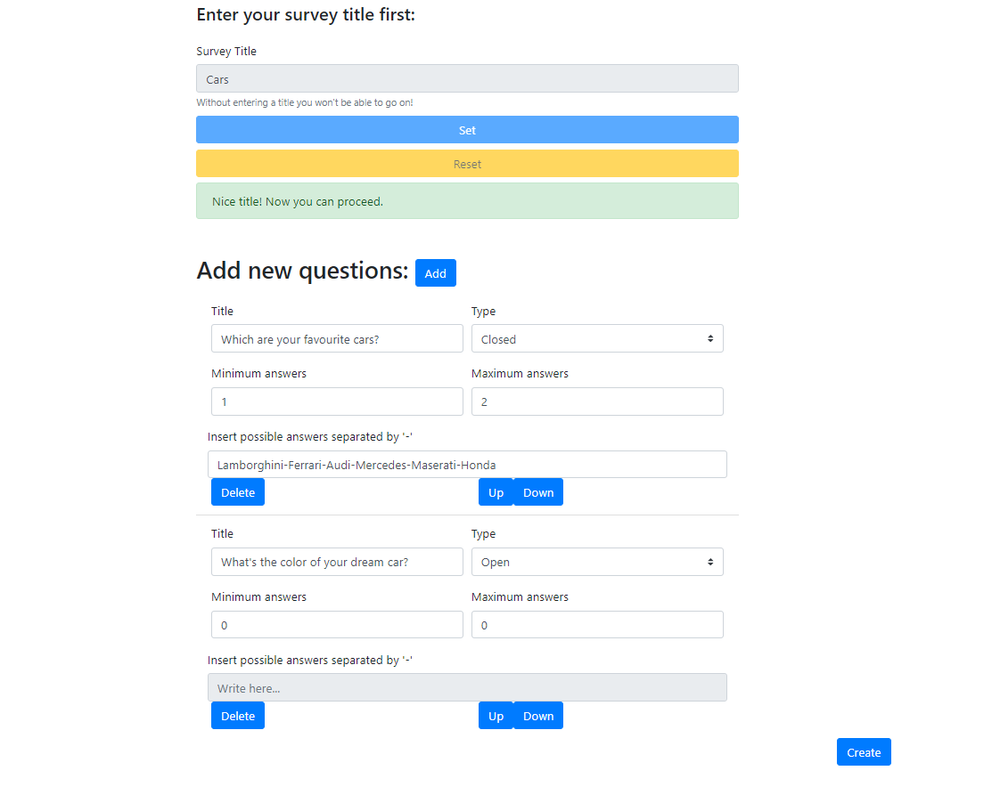

# Exam #1: "Survey"

## Student: s292473 RUSSO FRANCESCO PIO 

## React Client Application Routes

- Route `/`: this route leads to the principal page where the user can see the list of survey, choose one of them and answer. Moreover, it's possible to use the Login button to go to another route where it's possible to log-in.
- Route `/login`: this route let the admin login if he's already signed;
- Route `/survey?op=addResponse&sid=0`: this route lead to the form through which the user can answer the survey question only after he set a username. If the admin is logged, this route displays the form in read-only mode with the user answers. The params 'op' (shown only in user-mode) and 'sid' stands for the type of operation (only for descriptive purpose) and the current survey ID;
- Route `/admin/firstAdmin`: this route leads to the admin page where he can choose to see the user answers to one of his survey by clicking on the survey title, he can choose to create a new survey by clicking on the 'Create' button, he can choose to logout by clicking the 'Logout' button. The param displays the current administrator nickname;
- Route `/newSurvey`: this route leads to the form through which a logged admin can create a new survey;

## API Server

- POST `/api/login`
  - The request parameter contains a variable containing the HTTP method, content-type and body of the request (the body is a dictionary containing the admin nickname and the inserted password);
  - The body response contains the response status;
- GET `/api/surveys`
  - request parameters are empty;
  - response body content contains the sruvey list retrieved from the server;
- GET `/api/questions`
  - request parameters contain the survey ID in query form (i.e. '?sid=${surveyID}');
  - response body content contains the question list of the survey with ID equal to that passed as parameter;
- GET `/api/questionAns`
  - request parameters contain the survey ID and the question ID in query form (i.e. '?sid=${surveyID}');
  - response body content contains the possible answers to give to the question with ID equal to that passed as parameter;
- POST `/api/saveUser`
  - request parameters contains a variable containing the HTTP method, content-type and body of the request, request body content contains the survey ID to which store the username;
  - response body content contains the user ID related to the just added username;
- POST `/api/saveUserAnswers`
  - request parameters contains a variable containing the HTTP method, content-type and body of the request, request body content contains the (single) asnwer given by the user with ID equal to the passed one;
  - response body content may contain a error message;
- GET `/api/whoami`
  - request parameter is a dictionary and request body content contains admin credentials;
  - response body content is HTTP status;
- POST `/api/logout`
  - request parameter is a dictionary and request body content contains admin credentials;
  - response body content is HTTP status;
- GET `/api/users`
  - request parameters contain the survey ID in query form (i.e. '?sid=${surveyID}');
  - response body content contains the user list who responded to the survey with ID equal to the passed one;
- GET `/api/userResponses`
  - request parameters contain the survey ID and the user ID in query form (i.e. '?uid=${usrObj.uid}&sid=${surveyID}');
  - response body content contains a dictionary with user responses to the questions of the survey with ID equal to the passed one;
- POST `/api/newSurvey`
  - request parameters contains a variable containing the HTTP method, content-type and body of the request, request body content contains the admin nickname, the survey title and the number of questions the survey contains;
  - response body content contains the new survey ID related to the survey just inserted;
- POST `/api/saveQuestions`
  - request parameters contains a variable containing the HTTP method, content-type and body of the request, request body content contains the survey ID, the question to be inserted and the index corresponding to the question ID;
  - response body content is empty;

## Database Tables

- Table `admins` - contains username (STRING - admin username, primary key in the table), psw (STRING - encrypted password), sid (INT - survey id created by the admin);
- Table `questions` - contains sid (INT - survey id of the question), title (STRING - question title), type (INT - possible values are '0' for closed-answer question and '1' for open-ended question), min_r (INT - minimum number of responses to the question), max_r (INT - maximum number of responses to the question), qid (INT - question id: it is useful to retrieve different questions belonging to the same survey), rowid (INT - row identifier, primary key in the table);
- Table `responses` - contains qid (INT - question id, it allows, combined with survey id, to retrieve to which question the response refers to), resptext (VARCHAR(200) - response text whose maximum length is equal to 200 char), uid (INT -  user identifier, it allows to identify the user who submitted the response), rid (INT - response identifier, primary key in the table), sid (INT - survey identifier, it allows, combined with question id, to retrieve to which question the response refers to);
- Table `surveys` - contains sid (INT - survey id, primary key in the table), ausername (STRING - admin username, it indicates which admin created the survey), title (STRING - survey title), qnum (INT - number of question contained in the survey);
- Table `users` - contains uid (INT - user identifier, primary key in the table), username (STRING - username inserted before compiling survey), sid (INT - survey identifier, it indicates to which survey the user submitted responses);
- Table `possibleAnswers` - contains aid (INT - answer id, primary key in the table), sid (INT - survey id, it indicates to which survey the possible answers refers to), qid (INT - question id, it indicates to which question the possible answer refers to), plntext (STRING - text of the possible answer);

## Main React Components

- `survey.js` (in `src`): this file contains the method through which it's possible to call server APIs;
- `AdminContext` (in `AdminContext.js`): it allows to know if the admin is logged or not in the whole application;
- `AnswerContext` (in `AnswerContext.js`): it allows some components to know the user responses;
- `LoginForm` (in `LoginForm.js`): it allows to enter admin nickname and password to login and so apply the admin mode;
- `SurveyList` (in `SurveyList.js`): it displays the list of surveys allowing (in user mode) to click on the survey title to answer. In admin mode this component displays all the survey created by the logged admin allowing to click on their title to see all the user answers;
- `SurveyForm` (in `SurveyForm.js`): it displays the form which allows the user to answer all the survey questions only after he set a username. Morevore, it shows the question list with all the possible answers for closed-answer questions and a text-area for open-ended questions. If all the constraints (mandatory, min, max, valid username) are satisfied is possible to save the answers given by the user by the 'Submit' button, otherwise an alert will be shown;
- `NewSurveyForm` (in `NewSurveyForm.js`): it displays a form  through which the logged administrator can create a new survey. The admin nust enter the survey title to proceed to question creations. It's possible to create a new question by clicking on the 'Add' button which will create a small form to retrieve the question info (question title, min and max answers, question type, ecc...). Moreover it's possible to delete or move a question by clicking on the 'Delete' and 'Up'/'Down' buttons respectively. If everything is alright (survey title set, min < max, ecc...) it will be possible to store the survey and the related questions by clicking the button 'Create', otherwise an alert will be shown;
- `PossibleAnswer` (in `QuestionItem.js`): it allows to create a different type of answer depending on the question type: if the question is a closed-answer question this component return a component containing checkboxes, ecc... othewise return a text-area component;

## Screenshot

## Users Credentials

- firstAdmin, password -> This admin created survey `Animals`, `Football teams` and `Countries`;
- secAdmin, verystrongpsw -> This admin created survey `Flowers`, `Musicians` and `Cars`;